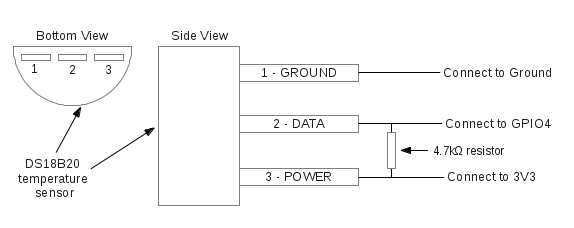

# Temperature sensor

## Connecting the Temperature Sensor
We need:

+ A DS18B20 temperature sensor. Output leads: red (VCC), yellow (DATA), black (GND)
+ A 4.7k resistor
+ A brunch of wires

Connect as follows


## Reading the Temperature from Terminal
```bash
sudo modprobe w1-gpio
sudo modprobe w1-therm
cat /sys/bus/w1/devices/28-000005212010/w1_slave
```

## Reading the Temperature from Python
```python
def read_temperature():
	tfile = open(THERMFILE)
	# Read all of the text in the file.
	text = tfile.read()
	# Close the file now that the text has been read.
	tfile.close()
	# Split the text with new lines (\n) and select the second line.
	secondline = text.split("\n")[1]
	temperaturedata = secondline.split(" ")[9]
	temperature = float(temperaturedata[2:])
	temperature = temperature / 1000
	return temperature
```

# Send Push Notifications from Raspberry Pi
## Setup Instapush Account & Install app
See [this post](http://videos.cctvcamerapros.com/digital-io-alarm-in-out/send-push-notifications-from-raspberry-pi.html) for details.

## Python Code to Send Notification
```python
from instapush import Instapush, App
def push_notification(message):
	app = App(appid=INSTAPUSH_ID, secret=INSTAPUSH_SECRET)
	app.notify(event_name='ThermAlert', trackers={ 'message': message})

# send notification if temp is too low or too high
if __name__ == '__main__':
	temp = read_temperature()
	if mona_is_sleeping():
		if temp < TEMP_LOWER:
			push_notification("It's too cold for Mona ({:4.2f} now)!".format(temp))
		elif temp > TEMP_UPPER:
			push_notification("It's too hot for Mona ({:4.2f} now)!".format(temp))
```